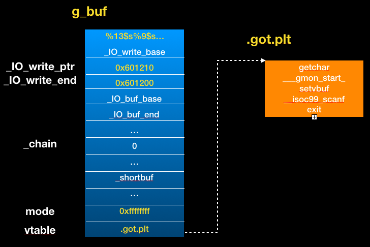
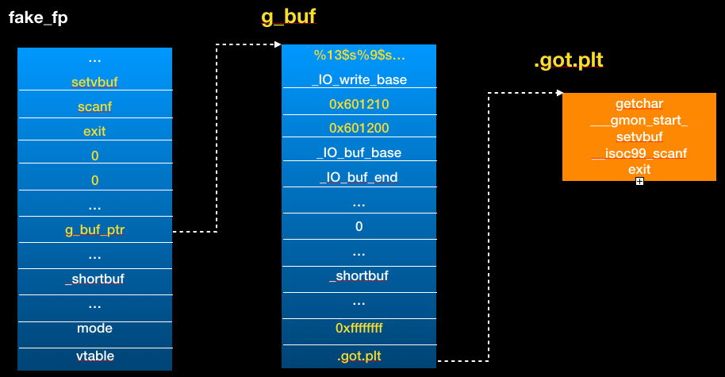

# Jim Moriarty

## Vulnerability 
+ A NULL byte overwrite

	If you input an invalid size while allocating the `g_buf`,it would be record. But when you allocate successfully,the program will still append a NULL byte with the invalid size. So you can write a NULL byte on heap or libc.
	
	
## Exploit
+ Allocate a large buffer so that it can be in front of libc.
	+ You need to calculate the size and the offset of stdin first. 
+ Overwrite the last byte of `_IO_buf_base` with null byte in the stdin structure
	+ It's very similar to [parrot](https://github.com/scwuaptx/CTF/blob/master/2017-writeup/twctf/Parrot.md)
+ Forge the FILE structure in `g_buf`
	+ We want to trigger virtual function call in `_IO_flush_lockp` like [house of orange](http://4ngelboy.blogspot.tw/2016/10/hitcon-ctf-qual-2016-house-of-orange.html). 
		+ So we need to let
			+ `_IO_write_ptr` > `_IO_write_base`
			+ `mode` <= 0
			+ `vtable` point to the function that we want to call. (We want to call `scanf`)

+ Overwrite the element in the `stdin` structure
	+ Use the last `getchar()` to read data
	+ Overwrite the `_chain` let point to `g_buf_ptr`
		+ But we don't know address of `g_buf_ptr` so that we can't directly control it.
		+ So we need to let `g_buf_ptr` be `_chain` pointer. 
			+ It is very close to `.got.plt`

+ Trigger `_IO_flush_all_lockp`
	+ It would be called in `exit`.
		+ Because it just want to flush all stream :)
	+ Now, the linked list of FILE structure is
		+ `_IO_list_all` -> `stderr` -> `stdout` -> `stdin` -> `fake_fp` -> `g_buf_ptr`
	+ Finally, it would call `scanf(g_buf_ptr)`
+ Use scanf to do format string attack
	+ We can use `scanf("%13$s%9$s")`
		+ `%13$s`: Just read until stdin buffer is empty 
		+ `%9$s` : Read data to stack
 	+ It would trigger stack overflow and you can do ROP.
+ [exploit](jim_moriarty.py)
