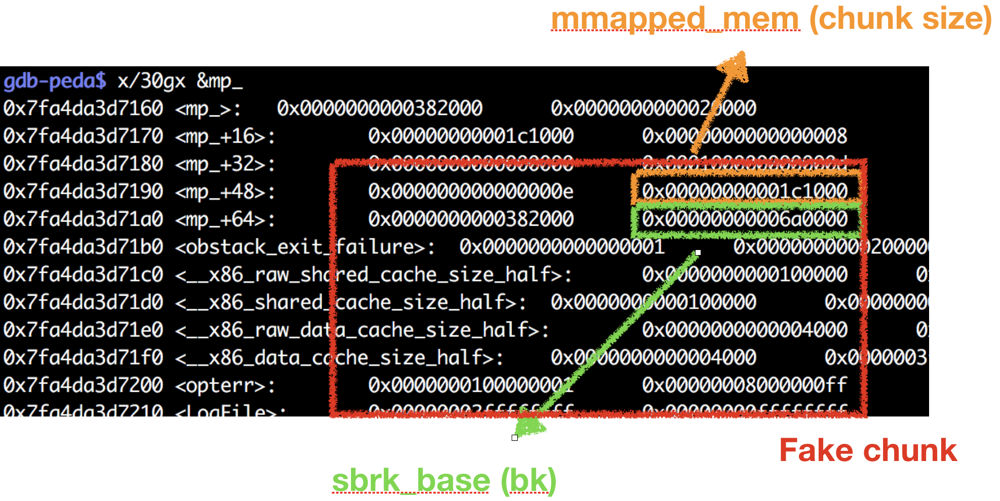

# Damocles 

### Vulnerability

+ Heap overflow in allocate() function

```
void allocate(){
    char *tmp = NULL ;
    char buf[4];
    size_t size ;
    printf("Size : ");
    size = read_long();
    tmp = malloc(size);
    if(!tmp){
        puts("Allocate failed");
        _exit(-1);
    }
    printf("Content :");
    read_input(tmp,size);
    while(1){
        printf("Finish ? (Y/n)");
        read_input(buf,2);
        if(buf[0] == 'Y' || buf[0] == 'y'){
            puts("Done !");
            ptr = tmp ;
            return ;
        }else{
            printf("Size :");
            size = read_long();  //heap overflow
            printf("Content :");
            read_input(tmp,size);
        }
    }
}
``` 


### Exploitation

+ Allocate mmap chunks many time let `libc address + mp_.mmapped_mem` is a writable page.
	+ You can not allocate a very large chunk at once, because we need to update `main_arena.system_mem` let  `main_arena.system_mem` is larger than `mp_.mmapped_mem`

+ Allocate some fastbin chunk and consolidate it to create some unsorted bin chunk.

+ Unsorted bin corruption
	+ This time, there is a valid unsorted bin chunk in `mp_`

		+ unsorted bin only check `chunksize < main_arena.system_mem`

	+ Use heap overflow to overwrite the bk of unsorted bin chunk with the valid chunk in `mp_`
		+ We don't no the libc address, but it close to unsorted bin. So we can use partial overwrite. Just bruteforce 1/16 probability.

	+ Allocate a large chunk with `mp_.mmapped_mem` bytes, you will get the chunk in `mp_`
		+ The chunk is so large that you can overwrite many thing in glibc.

+ Control the flow
	+ Overwrite `__malloc_hook` then do ROP, you will get the shell.
+ Exploitation
	+ [exp.py](exp.py)