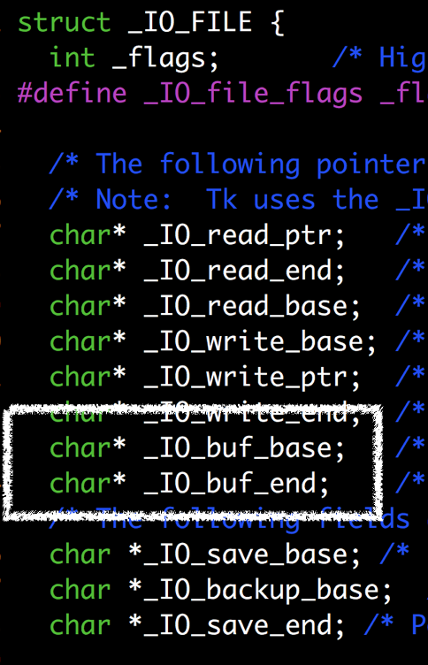
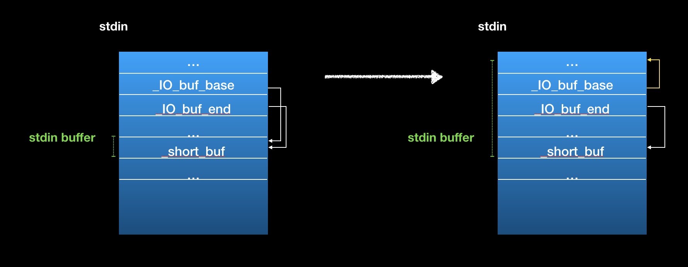
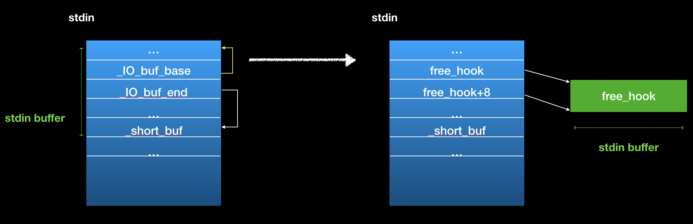

# Parrot

## Vulnerability
- Information leak
	- Write is not be terminate by null byte
	- It can leak some data on the heap

- A null byte overwrite
	- If you give a large size,it would read faild.
		- But it's not check and it would put a null byte to the address.

## Exploit
- Leak libc
	- Create a unsorted bin on the heap
	- Using the vulnerability to leak data
- Overwrite the last byte of `_IO_buf_base` with null byte in the stdin structure
   
	- The pointer point to `_short_buf`                            which in the stdin structure at first
	- You will have a stdin buffer in stdin structure
	- If we use any stdin related functions, we could overwrite `_IO_buf_end`
	
- Overwrite `_IO_buf_base` and `_IO_buf_end`
	- Use `scanf` to read data 
	- It's can control the stdin buffer then you can write to arbitrary memory
	 
- Overwrite `__free_hook`
	- Control the flow 
	- [exploit](parrot.py)
