HITCON CTF 2019 QUAL dadadb
-

## Description

### Environment

+ Windows x64 on windows sever 2019 
	+ Similar to Windows 10 (1809)
+ DEP
+ ASLR
+ CFG
+ Disallow Child Process
	+ You can not create new process.
+ Private Heap
	+ Independent memoy pool
 
### Note 
+ It a windows heap challenge
	+ If you are unfamiliar at windows heap, you can reference my slide
		+ [English](https://www.slideshare.net/AngelBoy1/windows-10-nt-heap-exploitation-english-version)
		+ [Chinese](https://slideshare.net/AngelBoy1/windows-10-nt-heap-exploitation-chinese-version)

	+ The following command in Windbg will be very helpful
		+ `!heap`
		+ `!heap -a [heap address]`
		+ `dt _HEAP [heap address]`
		+ `dt _HEAP_LIST_LOOKUP [address]`
		+ `dt _LFH_HEAP`
		+ More Windbg usage 
			+ [`https://github.com/hugsy/defcon_27_windbg_workshop`](https://github.com/hugsy/defcon_27_windbg_workshop)

### Program

+ A simlpe database
	+ After login, you can add/view/remove data by key
	+ Use array and linked list to store data

+ Structure
	+ KEY_SIZE 0x40 

		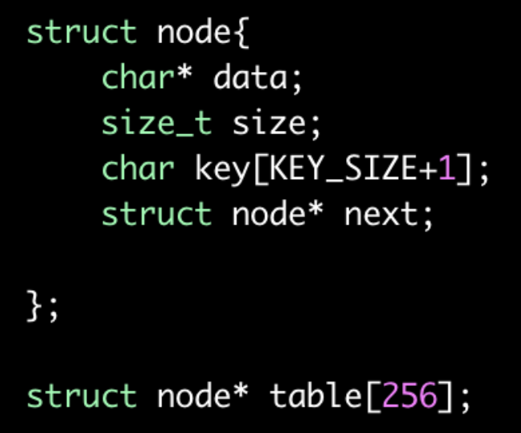
		

+ Login
	
	Read user data from "user.txt". 
	+ ADD
		+ Add data by key
		+ It will search node in table.
		+ If not found, it will create new node and insert node to the table
			+ Insert into in front of linked list
		+ If found it will reuse the node and allocate a new data buffer
	+ VIEW
		+ Read data by key
		+ It will use key to search node in table
		+ If found, it will write data to stdout
	+ REMOVE
		+ Delete data by key
		+ It will use key to search node in table
		+ If found, it will delete the node in table and linked  
+ Logout

 

## Vulnerability

### Heap overflow
+ When it reuse the node
	+ It will use the size of old data buffer 
when reading data to new buffer
+ It will lead to heap overflow, when the
old size of data buffer larger than new
buffer

	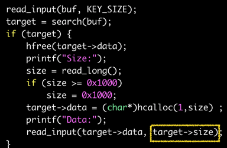

## Exploit

### Arbitrary memory reading
Because it use private heap, we can easy use heap overflow to overwrite data pointer to do arbitrary memory reading. But I will demonstrate in normal case (default heap)

+ In default heap case, it will use Heapallocate when program start.
	+ There are many unstable hole in the heap.

+ It also used in many Windows API, so it hard to locate heap and heap layout
 
	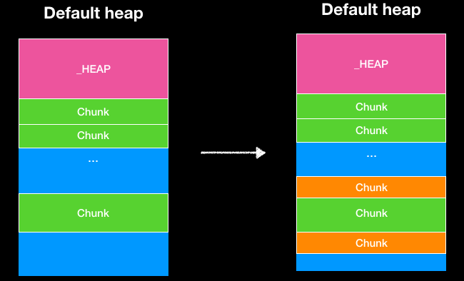
+ If we want to have a stable leakage, we can use LFH
	+ There are less checks in LFH.
		+ We can use it to prevent some heap detection.
	+ I use the following diagram to show you how to do it
		+ We can use node to fill UserBlock first 
	
		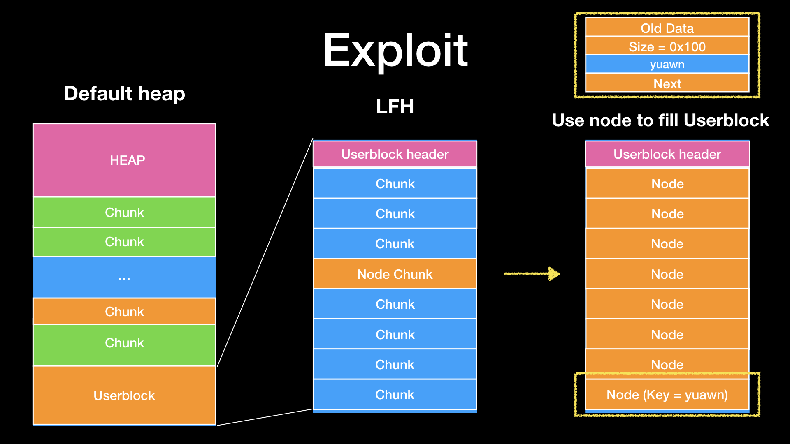

		+ Remove a node
			+ That is, it will leave a hole in UserBlock 
 
		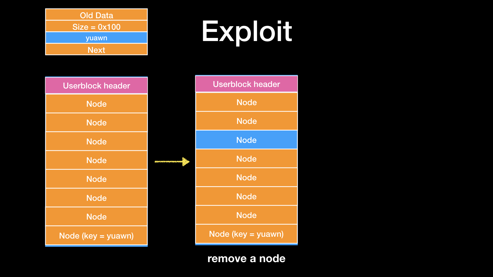

		+ Use data buffer to fill the hole

		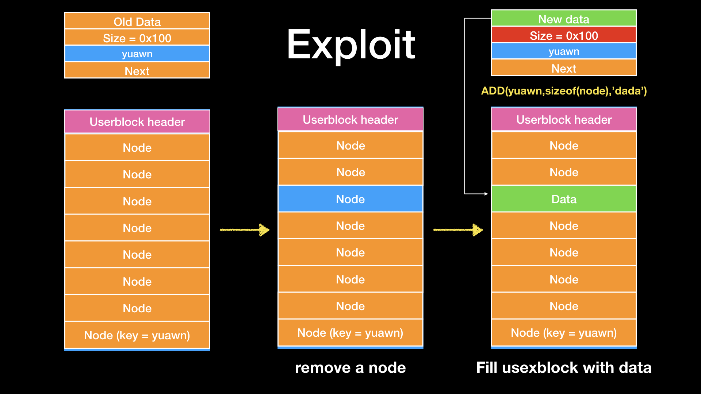
		
		+ Now we can use vulnerability to leak something in next chunk.
			+ Heap address
			+ Key of next chunk
		+ Assume key of next chunk is ddaa
		
		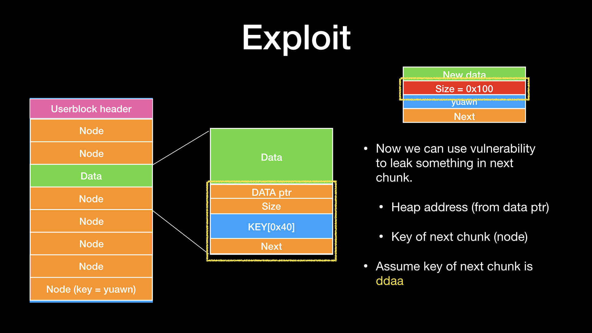
		
		+ After leaking heap address, we can use heap overflow to overwrite next chunk with address we want to leak
		
			+ By the way, Heap overflow will corrupt header of next chunk.
			+ When we use add to update data, it will free original data.  In back-end allocator it will encounter heap corruption detect if you do not forge header.
			+ In LFH, it does not check ! 
That is, we can do arbitrary memory reading by key(ddaa)  

+ After we can do arbitrary memory reading
	+ We can get address of 
		+ ntdll (from _HEAP->lock)
		+ PEB (from ntdll)
		+ binary (from ntdll!PebLdr)
		+ kernel32 (from IAT of binary)
		+ TEB (from PEB)
		+ Stack address (from TEB)
			+ The location of return address (scan return address at stack)

### Arbitrary memory writing

+ Next step, we need to do arbitrary memory writing to overwrite return address with ROP
+ Intended solution

	Forge a fake chunk at bss to overwrite fp and then do arbitrary memory writing
	+ In order to forge a fake chunk at bss to overwrite fp, we need to prepare some chunk in back-end allocator first.
	+ I divide into five part
		1. Prepare a chunk used to overwrite other chunk (chunk A)
			+ We can choose a suitable chunk such that allocate in the largest free chunk

			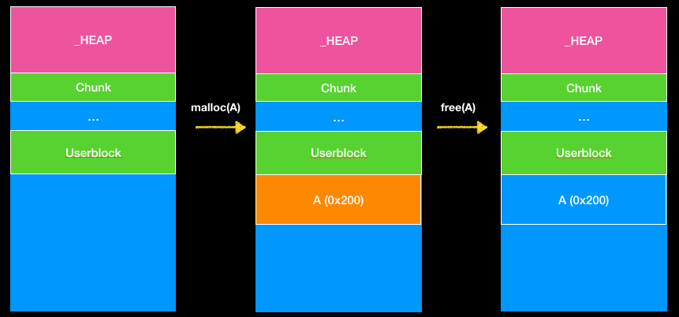
			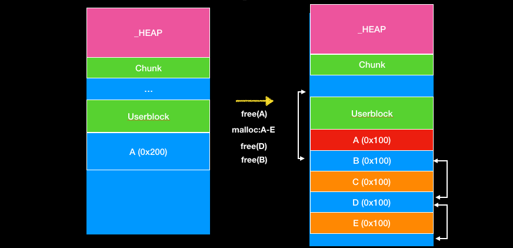
			
			+ After we prepare some chunks, the heap layout will like the diagram
				+ A can be used to overflow B
				+ B, D are free chunk with same size
			+ We can use A to leak Flink and Blink of B
				+ That is, we can get address of B and D
		2. Forge a legal chunk at password buffer so that we can use malloc to get the chunk.
	
			+ At first, the layout will like the diagram.
		
				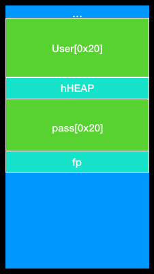

			+ We can forge a legal chunk with same header of chunk B.
			
				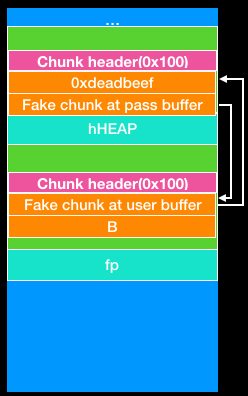
		
		
		3. Prepare a free chunk to be overwrite with fake Flink & Blink.
			+ Use chunk A to overwrite Flink and Blink of chunk B
				+ You should make sure that double linked does not corrupted.
				+ B will also be puted at ListHint[0x10]
				+ We have already prepared every thing on heap

			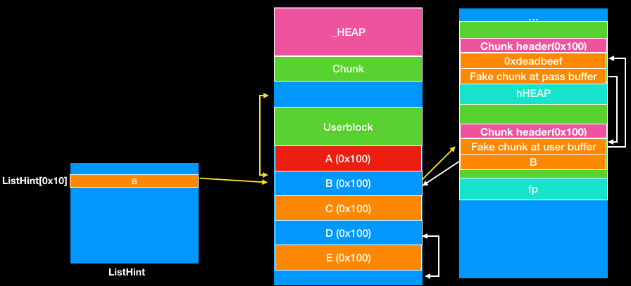

		4. Get the fake chunk
			+ We can use malloc to get our fake chunk after we forge the linked list. 

			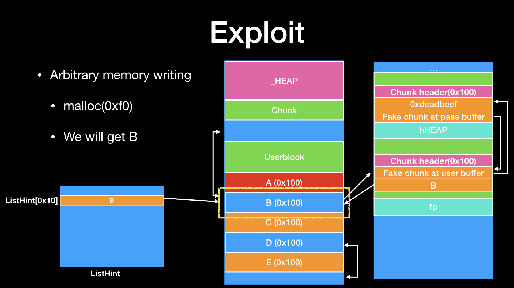
			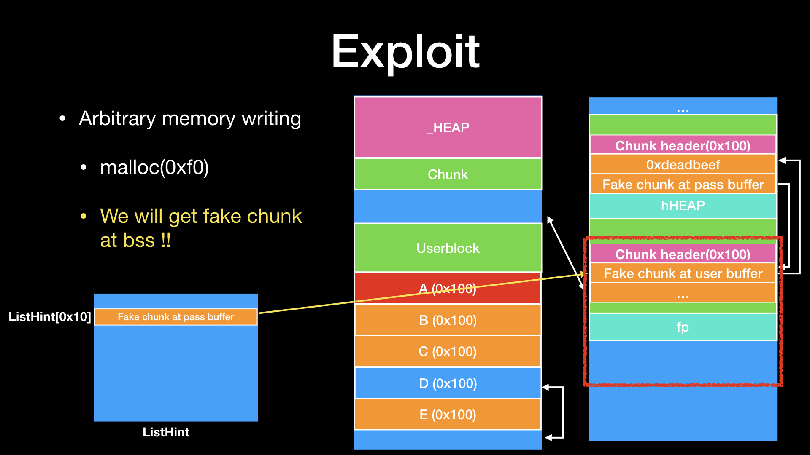
			
			+ By the way, it only check header and double linked list of chunk when it use malloc. 
				+ It does not check the header of next chunk
				+ Sometimes it’s very useful
		5. Forge `FILE` structure
			+ We can forge the FILE structure follow by fp and overwrite fp with the fake FILE structure.
			+ That is, we can use fread to do arbitrary memory writing !

				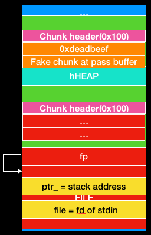
			
			+ If you does not understand FILE structure exploitation you can reference my slide
				+ [Play with FILE structure](https://www.slideshare.net/AngelBoy1/play-with-file-structure-yet-another-binary-exploit-technique)
				+ [About FILE in challenge](dadadb.pdf)
					+ From p42 to p53 

### Control RIP
After we have arbitrary memory writing we can overwrite return address on stack with ROP. But it disallow child process , you can not create new process.

+ We need use ROP to read flag.txt, but it’s a little complicated.
+ So we use ROP to do VirtualProtect to change page permission so that we can jump to shellcode.

After we can run shellcode, we can read files more easily.

+ We use some function to read file
	+ Kernel32 (because we only provide `kernel32.dll` and `ntdll.dll` for challenger)
		+ `CreateFile`/`ReadFile`/`GetStdHandle`/`WriteFile`

	+ If it use default heap
		+ You should create new heap for windows API, otherwise you will encounter heap detection
			+ Overwrite `_PEB->ProcessHeap`/`ucrtbase!crtheap`/`ntdll!ldrpheap` with new heap.

+ [exp.py](dadadb.py)

### Unintended Solution
Forge a fake chunk on stack to overwrite return address

+ You need to leak more data
	+ Cookie
	+ RSP

### Note

Actually, the challenge originally designed on the default heap. So I enable LFH to defeat heap randomness and get a stable leak at first.

But a few days before HITCON CTF 2019 QUAL, I wanted more people to understand the heap mechanism and make it easier to solve. 
Moreover, I don’t want too much people to be stuck in randomness on default heap. 
So I change it to use private heap.
It will be more stable.

Thank you for joining the HITCON CTF 2019 Qual. I hope everyone can learn more from our CTF.
